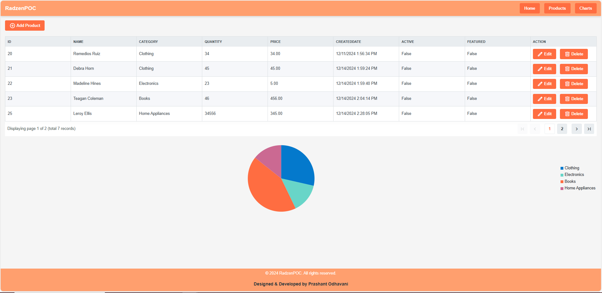
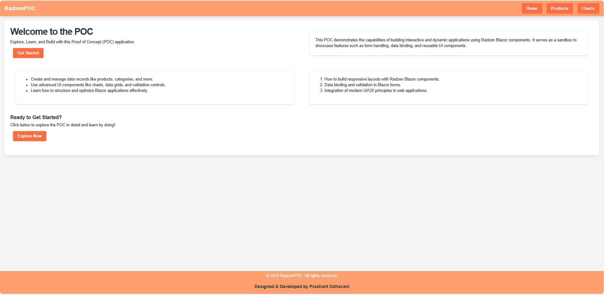
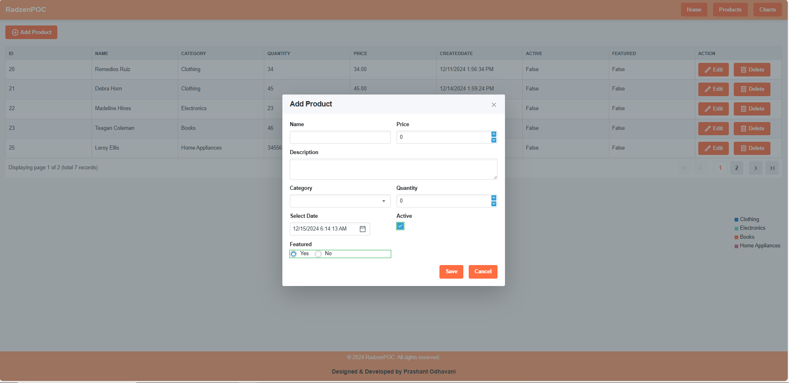
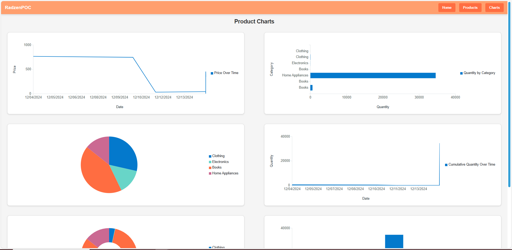
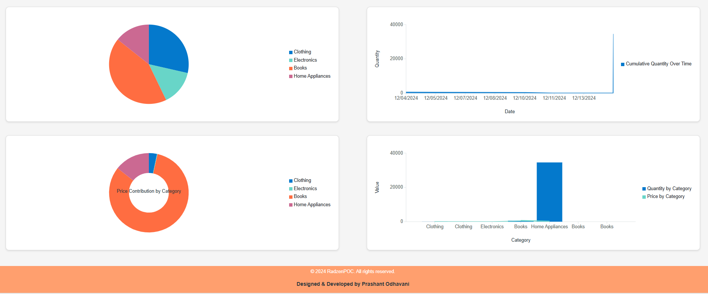

# POC Application with Radzen Blazor Components



Welcome to the POC Application built with Radzen Blazor components! This repository showcases a Proof of Concept (POC) application designed to demonstrate the power of Radzen Blazor components in building interactive and responsive web applications.

---

## Table of Contents

1. [Overview](#overview)
2. [Features](#features)
3. [What You Can Learn](#what-you-can-learn)
4. [Screenshots](#screenshots)
5. [Getting Started](#getting-started)
6. [How to Contribute](#how-to-contribute)
7. [License](#license)

---

## Overview

This POC application is a comprehensive demonstration of:

- Building forms with validation.
- Managing dynamic data through data-binding.
- Designing user-friendly interfaces using modern UI/UX principles.

Whether you're a developer looking to explore Blazor's capabilities or someone curious about building efficient web applications, this POC is for you!

---

## Features

- **Dynamic Forms**: Create, read, update, and delete (CRUD) operations with validation.
- **Interactive Components**: Utilize Radzen Blazor controls like dropdowns, textboxes, numeric fields, and more.
- **Responsive Design**: Ensures compatibility across devices and screen sizes.
- **Reusability**: Learn how to structure reusable UI components.

---

## What You Can Learn

Through this POC, you'll gain insight into:

1. Creating robust Blazor web applications.
2. Implementing Radzen Blazor components effectively.
3. Enhancing user interaction with modern design principles.

---

## Screenshots

Here are some visuals of the POC in action:

### Home Page


### Product Management Page


### Detailed Form with Validation


### Charts





---

## Getting Started

Follow these steps to set up and run the POC application on your local machine:

### Prerequisites
- .NET SDK 9.0
- Radzen Blazor components (installed via NuGet)
- Visual Studio Code or Visual Studio 2022+

### Installation

1. Clone the repository:
   ```bash
   git clone https://github.com/Prashant-Odhavani/RadzenPOC.git
